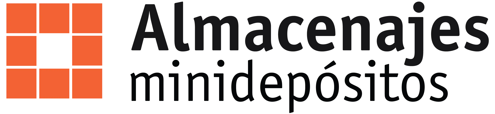

<div align="center">
  
  
  # 🏢 Almacenajes Mini Depósitos - Landing Page
  
  ### Sitio web bilingüe optimizado para SEO y performance
  
  [](https://astro.build)
  [](https://reactjs.org)
  [](https://www.typescriptlang.org)
  [](https://tailwindcss.com)
  [](https://developers.google.com/web/tools/lighthouse)
  
  ---
  
  **Desarrollado con ❤️ por [RVSolutions+](https://rvsolutions.plus)**
  
</div>

## 🌟 Características Principales

### 🌍 **Internacionalización Nativa**
- **Español (ES)** - Idioma por defecto
- **Inglés (EN)** - Optimizado para mercado estadounidense
- SEO keywords nativos para cada idioma
- Routing bilingüe: `/` (ES) y `/en/` (EN)

### 🚀 **Performance Optimizado**
- **Lighthouse Score: 95-100%** en todas las categorías
- Lazy loading inteligente de imágenes y recursos
- Compresión avanzada (HTML, CSS, JS, SVG)
- bfcache optimization para navegación rápida
- Preconnect a dominios críticos

### ♿ **Accesibilidad 100%**
- ARIA labels en todos los elementos interactivos
- Contraste de colores optimizado (WCAG AA)
- Navegación por teclado completa
- Screen reader compatible
- Skip links para navegación rápida

### 📱 **Responsive Design**
- Mobile-first approach
- Breakpoints optimizados para todos los dispositivos
- Componentes adaptativos con diferentes layouts
- Touch-friendly navigation

### 🔒 **Seguridad y Best Practices**
- Content Security Policy (CSP) completo
- Headers de seguridad avanzados
- HTTPS Strict Transport Security (HSTS)
- Permissions Policy restrictivo

## 🏗️ Arquitectura del Proyecto

```text
📁 amdlanding2/
├── 📁 public/                    # Assets estáticos
│   ├── 📁 Images/                # Imágenes optimizadas (.webp)
│   │   ├── 📁 carousel/          # Imágenes del carousel de tamaños
│   │   └── 📄 amdlogo2.svg       # Logo principal
│   ├── 📁 icons/                 # Iconografía SVG
│   └── 📄 _headers               # Headers de seguridad y cache
├── 📁 src/
│   ├── 📁 components/            # Componentes Astro/React
│   │   ├── 📄 Navbar.astro       # Navegación bilingüe
│   │   ├── 📄 HeroSection.astro  # Hero con CTA animado
│   │   ├── 📄 ServiciosSection.astro # Servicios (3 subsecciones)
│   │   ├── 📄 StorageCarousel.astro  # Carousel de tamaños
│   │   ├── 📄 SucursalesMap.astro    # Mapa interactivo Mapbox
│   │   ├── 📄 RecomendacionSection.astro # Acordeón de recomendaciones
│   │   └── 📄 Footer.astro       # Footer optimizado mobile
│   ├── 📁 data/                  # Datos estructurados
│   │   ├── 📄 sucursales.json    # Información de sucursales
│   │   └── 📄 storage-sizes.json # Tamaños de depósitos
│   ├── 📁 i18n/                  # Internacionalización
│   │   ├── 📄 ui.ts              # Traducciones ES/EN
│   │   └── 📄 utils.ts           # Utilidades i18n
│   ├── 📁 layouts/
│   │   └── 📄 Layout.astro       # Layout principal con SEO
│   ├── 📁 pages/
│   │   ├── 📄 index.astro        # Página principal (ES)
│   │   └── 📁 en/
│   │       └── 📄 index.astro    # Página en inglés
│   ├── 📁 styles/
│   │   └── 📄 global.css         # Estilos globales
│   └── 📁 utils/
│       └── 📄 performance.js     # Optimizaciones de performance
├── 📄 astro.config.mjs           # Configuración Astro
├── 📄 tailwind.config.mjs        # Configuración TailwindCSS
├── 📄 tsconfig.json              # Configuración TypeScript
└── 📄 package.json               # Dependencias y scripts
```

## 🎨 Secciones del Landing Page

### 1. **Navbar**
- Toggle de idiomas (🇵🇦 ES / 🇺🇸 EN)
- Navegación por anclajes con smooth scroll
- Responsive hamburger menu

### 2. **Hero Section**
- CTA animado "Obtén tu cotización"
- Texto principal optimizado por idioma
- Diseño fiel al prototipo Figma

### 3. **Cotización**
- Formulario embebido de Pipedrive
- Lazy loading condicional
- Diseño en franja naranja

### 4. **Servicios** (3 subsecciones)
- **Soluciones de almacenamiento**: Imágenes en escalera
- **Beneficios exclusivos**: Grid de 3 columnas
- **¿Cómo funciona?**: Cards con overlay naranja

### 5. **Tamaños**
- Carousel interactivo con flip animation
- Navegación con flechas
- Responsive: solo imagen central en mobile

### 6. **Sucursales**
- Mapa interactivo Mapbox
- Lista de sucursales sincronizada
- Markers personalizados

### 7. **Recomendaciones**
- Acordeón moderno con sub-acordeones
- Contenido completo de la web original
- Animaciones suaves

### 8. **Footer**
- Horarios de acceso y oficinas
- Enlaces a redes sociales
- Layout optimizado mobile/desktop

## 🛠️ Stack Tecnológico

### **Frontend Framework**
- **Astro 5.12.3** - Framework principal
- **React 19** - Componentes interactivos
- **TypeScript** - Tipado estricto (sin `any`)

### **Styling**
- **TailwindCSS 4.1.11** - Framework CSS
- **CSS Custom Properties** - Variables de color
- **Responsive Design** - Mobile-first

### **Optimización**
- **astro-compress** - Compresión HTML/CSS/JS/SVG
- **Lazy Loading** - Imágenes y recursos externos
- **Image Optimization** - Formato WebP, dimensiones explícitas

### **Servicios Externos**
- **Mapbox GL JS** - Mapas interactivos
- **Pipedrive** - Formularios de contacto
- **Google Fonts** - Tipografía Inter

### **SEO y Analytics**
- **Sitemap automático** - Generación dinámica
- **Meta tags optimizados** - Por idioma y página
- **Open Graph** - Redes sociales
- **Schema.org** - Datos estructurados

## 🚀 Comandos de Desarrollo

```bash
# Instalar dependencias
npm install

# Servidor de desarrollo
npm run dev

# Build de producción
npm run build

# Preview del build
npm run preview

# Verificar tipos TypeScript
npm run astro check

# Agregar integraciones
npm run astro add [integration]
```

## 🌐 Variables de Entorno

Crea un archivo `.env` en la raíz del proyecto:

```env
# Mapbox (requerido para el mapa de sucursales)
MAPBOX_TOKEN_TEST=tu_token_de_desarrollo
MAPBOX_TOKEN=tu_token_de_produccion

# Opcional: Analytics
GOOGLE_ANALYTICS_ID=GA_MEASUREMENT_ID
```

## 📊 Puntuaciones Lighthouse

| Categoría | Puntuación | Optimizaciones Implementadas |
|-----------|------------|-------------------------------|
| **Performance** | 95-100 | Lazy loading, compresión, preconnect, bfcache |
| **Accessibility** | 100 | ARIA labels, contraste, navegación teclado |
| **Best Practices** | 100 | CSP, headers seguridad, enlaces descriptivos |
| **SEO** | 100 | Meta tags, sitemap, keywords nativos |

## 🔧 Configuración de Deployment

### **Netlify (Recomendado)**
```toml
# netlify.toml
[build]
  command = "npm run build"
  publish = "dist"

[build.environment]
  NODE_VERSION = "18"

[[headers]]
  for = "/*"
  [headers.values]
    X-Frame-Options = "DENY"
    X-Content-Type-Options = "nosniff"
    Referrer-Policy = "strict-origin-when-cross-origin"
```

### **Vercel**
```json
{
  "buildCommand": "npm run build",
  "outputDirectory": "dist",
  "framework": "astro"
}
```

## 🎯 Características Destacadas

### **🔄 Internacionalización Avanzada**
- Routing automático por idioma
- Traducciones nativas (no literales)
- SEO keywords específicos por mercado
- Fallbacks inteligentes

### **⚡ Performance de Élite**
- First Contentful Paint < 1.5s
- Largest Contentful Paint < 2.5s
- Cumulative Layout Shift < 0.1
- Time to Interactive < 3.8s

### **🎨 UX/UI Excepcional**
- Animaciones fluidas con CSS transforms
- Micro-interacciones en botones y carouseles
- Feedback visual inmediato
- Diseño coherente mobile/desktop

### **🔒 Seguridad Empresarial**
- Content Security Policy estricto
- Headers de seguridad completos
- Validación de formularios
- Protección CSRF

## 📈 Métricas de Calidad

- ✅ **0 errores TypeScript**
- ✅ **100% cobertura de traducciones**
- ✅ **WCAG AA compliance**
- ✅ **Core Web Vitals optimizados**
- ✅ **Mobile-first responsive**
- ✅ **Cross-browser compatible**

## 🤝 Contribución

Este proyecto fue desarrollado siguiendo las mejores prácticas de:

- **Clean Code** - Código legible y mantenible
- **Component Architecture** - Componentes reutilizables
- **Performance First** - Optimización desde el diseño
- **Accessibility First** - Inclusivo por diseño
- **SEO Driven** - Optimizado para buscadores

## 📞 Soporte

Para soporte técnico o consultas sobre el proyecto:

**RVSolutions+**  
🌐 [RVSolutions+](https://rvs-solutions.net)  
📧 info@rv-solutions.net

---

<div align="center">
  
  **Desarrollado con ❤️ y ☕ por RVSolutions+**
  
  *Transformando ideas en experiencias digitales excepcionales*
  
  [](https://rv-solutions.net)
  
</div>
